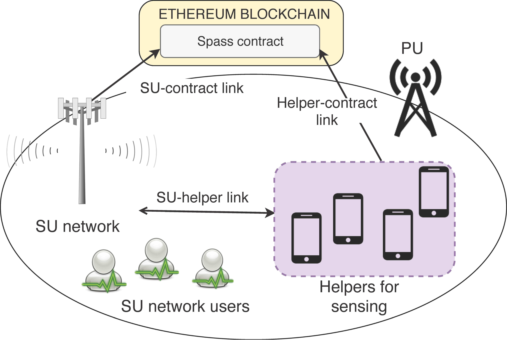

Spass: Spectrum Sensing as a Service via Smart Contracts
===============================

## What is Spass?

Mobile network operators can expand their capacity by aggregating their licensed spectrum with the spectrum discovered opportunistically, i.e., spatiotemporally unused spectrum by other primary users. For an accurate identification of the spectral opportunities, the mobile network has to deploy multiple sensors or it can offload this task to nearby nodes with sensing capabilities,
so called helpers. Unfortunately, incentives are limited for helpers to perform energy-wasteful spectrum sensing. Instead, we envision spectrum sensing as a service (Spass) in which a smart
contract running on a blockchain (BC) describes the required sensing service parameters and the contracted helpers receive payments only if they perform sensing accurately as agreed in
the contract. In this paper, we first introduce Spass and derive a closed formula defining the profitability of a Spass-based business as a function of the spectral efficiency, cost of helpers, and
cost of the service. Moreover, we propose two-threshold based voting (TTBV) algorithm to ensure that the fraudulent helpers are excluded from Spass. Via numerical analysis, we show that
TTBV causes almost zero false alarms and can exclude malicious users from the contract after only a few iterations. Finally, we develop a running prototype of Spass on Ethereum BC and share
the related source code on a publicly-available repository.

{:height="50%" width="50%"}

The full paper can be found here:
[full paper](https://www2.informatik.hu-berlin.de/~zubow/spass_dyspan_2018.pdf "Full paper")

## How to use it?

We implemented a proof-of-concept contract for Spass which contains the most important functionality.

You can test our contract using Remix IDE. Go to [RemixIDE](https://remix.ethereum.org "RemixIDE") and upload our code file Spass.sol.

## Example scenario

To understand the usage of the contract consider the following simple scenario with the contract owner (SU) and a single helper node (H). Here the SU deploys and initializes the contract whereas the helper registers and reports its sensing results. Afterwards the SU performs clearing so that the SU is able to withdraw its funds.

For this example the following accounts are used:

Owner SU: *0xca35b7d915458ef540ade6068dfe2f44e8fa733c*  
Helper H: *0x4b0897b0513fdc7c541b6d9d7e929c4e5364d2db*

Here are the minimal steps:

##### 1. SU, the owner of the contract, deploys the contract.
In Remix-IDE select the SU account and click on *deploy*.

##### 2. SU initializes the contract:
Call the function init() from SU account with the following arguments:  
<code>_sens_f: 8, _round_s: 800, _cp_f: 800, _max_p_f: 1, _min_p_d: 999</code>

##### 3. SU needs to fill up the contract with funds (ETH).
Call function increaseFunds() from SU account. Set a large enough value of ETH (in Remix IDE it can be set below the Gas limit), e.g. 1 ETH

##### 4. The helper H registers in the contract.
Call function registerSensingHelper() from H account with the following arguments:  
<code>_sHelper: 0x4b0897b0513fdc7c541b6d9d7e929c4e5364d2db, _id: 1, _priceSenseBit: 1000000, _p_f: 1, _p_d: 999</code>

##### 4. Helper H needs to check whether sufficient number of helpers were successfully registered:
Call function waitForOtherHelpers() from H account. Function returns <false>, i.e. enough helpers.

##### 5. Helper H reports his first sensing data:
Call function reportSensingData() from H account using the following arguments:  
<code>_sHelper: 0x4b0897b0513fdc7c541b6d9d7e929c4e5364d2db, _id: 1, _seq: 1, _data: [1,2]</code>

##### 6. At end of each round contract owner (SU) makes payments to helpers (here H):
Call function clearing() from SU account using the following arguments:  
<code>_seq: 1</code>

##### 7. Finally, helper H can withdraw any outstanding credit from the contract to his ETH account:
Call function withdraw() from account H.
Note: the account of H should increase afterwards by 6.4 gwei (=0.0000000064 ETH).

## How to reference to?

Just use the following bibtex:

    @inproceedings{bayhan_spass_dyspan18,
    author = {Bayhan, Suzan and  Zubow, Anatolij and Wolisz, Adam},
    title = {{Spass: Spectrum Sensing as a Service via Smart Contracts}},
    booktitle = {IEEE International Symposium on Dynamic Spectrum Access Networks (DYSPAN)},
    location = {Seoul, South Korea},
    year = {2018} 
    }
